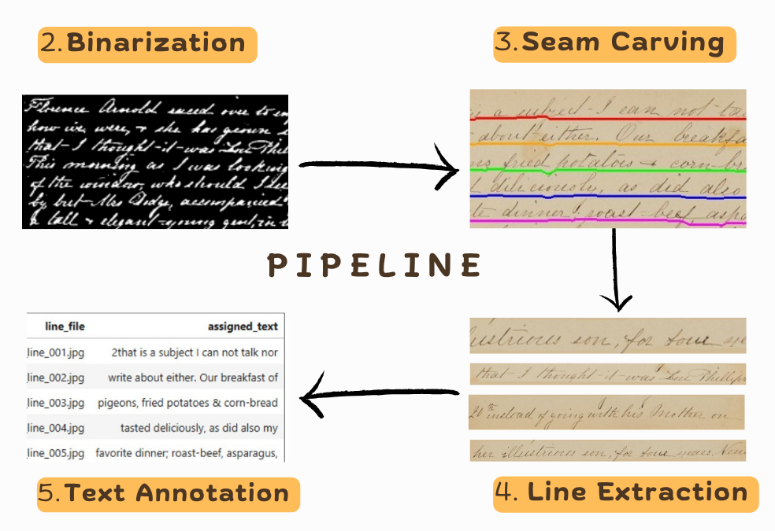

# Historical Manuscript Line Segmentation

**Annotation-free seam carving for preparing 19th-century cursive manuscripts for automated transcription.**

[](https://www.python.org/ )

## Overview

This project implements a computer-vision preprocessing pipeline that segments handwritten manuscript pages into individual text-line images. The pipeline was developed for 19th-century cursive diary pages, where dense handwriting, uneven spacing, and overlapping ascenders/descenders make full-page transcription computationally demanding.

The research compares a supervised `dhSegment` baseline with an unsupervised seam-carving approach. The supervised baseline did not generalize well with the available 13 manually annotated pages, so the project uses seam carving to identify low-energy paths through whitespace without requiring line-level annotations.

The project is described in the supplied [UWM 2026 poster](docs/poster/DedeM_Summer_2026_Poster_Final.pdf).

## Project poster

[View the project poster (PDF)](docs/poster/DedeM_Summer_2026_Poster_Final.pdf).


## Key Results

- Produced **3,701 line images from 171 manuscript pages** for downstream transcription-model training.
- Processed approximately **244 page images in under four minutes** on the project hardware.
- Used binary-image preprocessing, an energy function that penalizes ink pixels and page edges, and dynamic programming to trace horizontal seams.
- Identified limitations on densely overlapping cursive pages and documented future parameter-tuning and alignment work.

> This is a research prototype. Segmentation quality is strongest on pages with clearer line spacing; the project does not claim benchmark-level transcription accuracy.

## Pipeline

1. Crop dark scan borders.
2. Convert each page to a binary image.
3. Construct an energy map that penalizes ink and page edges.
4. Use dynamic programming to identify low-energy horizontal seams.
5. Remove or trace seams to extract text-line images.
6. Pair line images with transcription text using the project’s documented alignment heuristic.




## Repository contents

| Path | Purpose |
|---|---|
<!-- | `src/` | Reusable preprocessing and segmentation code. | -->
| `scripts/` | Reproducible command-line entry points. |
| `configs/` | Documented parameter sets for experiments. |
| `examples/` | Small, approved example inputs and outputs. |
| `docs/poster/` | The supplied UWM 2026 project poster. |
| `data/README.md` | Dataset access and attribution instructions; raw data is not stored here.

## Quick start

```bash
git clone https://github.com/PMartey/historical-manuscript-line-segmentation
cd historical-manuscript-line-segmentation
python -m venv .venv
# Windows PowerShell: .venv\Scripts\Activate.ps1
# macOS/Linux: source .venv/bin/activate
pip install -r requirements.txt
python scripts/optimized_seam_carving6.ipynb --input examples/input/[SAMPLE_FILE] --output examples/output/[RUN_NAME]
```

<!-- > Do not leave an untested quick-start command in the public README. -->

## Data access and responsible reuse

The full manuscript corpus is not redistributed in this repository. Consult [DATA_POLICY.md](DATA_POLICY.md) and [data/README.md](data/README.md) before acquiring, using, or redistributing collection material.

## Citation
 **Cite this repository** option on GitHub.

## Authors and acknowledgments

The supplied project poster credits Pamela Martey, Micah Hesketh, and Dr. Istvan Lauko. Confirm all author, institutional, source-collection, and funder wording before the public release.

## License

 See `LICENSE-DECISION.md`.

## References

1. Das, M., & Panda, M. (2023). *Seam carving, horizontal projection profile and contour tracing for line and word segmentation of language independent handwritten documents*. Results in Engineering, 19, 101110. https://doi.org/10.1016/j.rineng.2023.101110
2. Newberry. *Policies: Open Access Policy*. https://www.newberry.org/policies
3. [Project poster (PDF)](docs/poster/DedeM_Summer_2026_Poster_Final.pdf)
